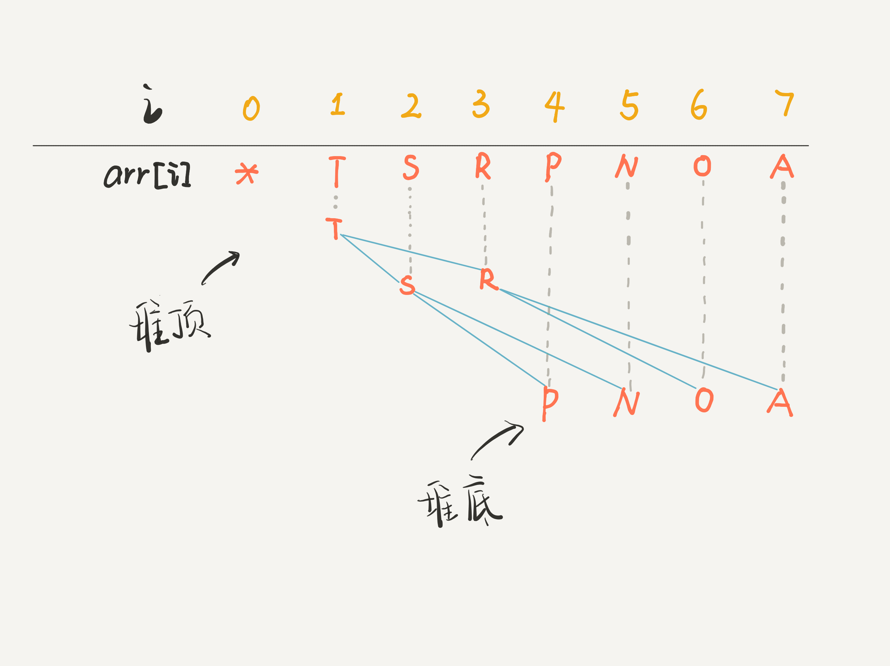

# CodeExercise：

## 简介：

记录从大一暑假开始的刷题之旅。

**PS：这个代码库保存了我从大一入学所刷的所有算法题，只是从2022年6月21日开始整理。**

---

## 日常刷题：

### 2022.6.21——数组

*周二——雷阵雨转阴——35℃/22℃*

*今天开始刷LeetCode中的《初涉算法》篇，先从数组开始：*

#### [26. 删除有序数组中的重复项](https://leetcode.cn/problems/remove-duplicates-from-sorted-array/)

**类型：** 数组	双指针

```cpp
class Solution {
public:
    int removeDuplicates(vector<int>& nums) {
        int fast = 0,slow = 0;
        while(fast<nums.size()) {
            if(nums[fast++]!=nums[slow]) {
                nums[++slow] = nums[fast-1];
            }
        }
        return slow+1;
    }
};
```

**时间复杂度：**	O(N)	**空间复杂度：**	O(1)

使用了**fast**和**slow**两个快慢指针进行判断，每次循环快指针都会向前走一位，通过快指针指向的位置和慢指针比较，若和慢指针所指向的数不同则慢指针走一位并将快指针所对应的值赋给慢指针指向的位置。

最后慢指针所指向的位置则为数组长度-1，所以返回**slow+1**即可。

详情参考：[双指针技巧秒杀七道数组题目 :: labuladong的算法小抄](https://labuladong.github.io/algo/2/18/21/)

*由上一题可延伸：*

#### [83. 删除排序链表中的重复元素](https://leetcode.cn/problems/remove-duplicates-from-sorted-list/)

**类型：**	链表

```cpp
class Solution {
public:
    ListNode* deleteDuplicates(ListNode* head) {
        if(head==nullptr) return nullptr;
        ListNode *slow = head,*fast = head;
        while(fast->next!=nullptr) {
            fast = fast->next;
            if(fast->val!=slow->val) {
                slow = slow->next;
                slow->val = fast->val;
            }
        }
        slow->next = nullptr;
        return head;
    }
};
```

**时间复杂度：**	O(N)	**空间复杂度：**	O(1)

同样使用快慢指针，详情见上文。

#### [27. 移除元素](https://leetcode.cn/problems/remove-element/)

**类型：**	数组		双指针

```cpp
class Solution {
public:
    int removeElement(vector<int>& nums, int val) {
        int slow = 0,fast = 0;
        while(fast!=nums.size()) {
            if(nums[fast++]!=val) {
                nums[slow++] = nums[fast-1];
            }
        }
        return slow;
    }
};
```

**时间复杂度：**	O(N)	**空间复杂度：**	O(1)

同样利用双指针，将重复的元素覆盖，最后返回数组长度为slow的值。

#### [283. 移动零](https://leetcode.cn/problems/move-zeroes/)

**类型：**	数组		双指针

```cpp
class Solution {
public:
    void moveZeroes(vector<int>& nums) {
        int slow = 0,fast = 0;
        while(fast!=nums.size()) {
            if(nums[fast++]!=0) {
                nums[slow++] = nums[fast-1];
            }
        }
        while(slow!=nums.size()) {
            nums[slow++] = 0;
        }
    }
};
```

**时间复杂度：**	O(N)	**空间复杂度：**	O(1)

利用上一题的做法最后在将**slow**指针往后的多余数替换为0。

#### [167. 两数之和 II - 输入有序数组](https://leetcode.cn/problems/two-sum-ii-input-array-is-sorted/)

**类型：**	数组		双指针	二分查找

```cpp
class Solution {
public:
    vector<int> twoSum(vector<int>& numbers, int target) {
        int left = 0,right = numbers.size()-1;
        while(left<right) {
            int sum = numbers[left] + numbers[right];
            if(sum == target) {
                return {left+1,right+1};
            } else if(sum < target) {
                left++;
            } else {
                right--;
            }
        }
        return {0,0};
    }
};
```

**时间复杂度：**	O(n log n)	**空间复杂度：**	O(1)

通过二分查找的方法先从数组的两端的和开始比较，若**sum**比**target**小，则**left+1**；若**sum**比**target**大，则**right-1。**

#### [344. 反转字符串](https://leetcode.cn/problems/reverse-string/)

**类型：**	递归		双指针	字符串

```cpp
class Solution {
public:
    void reverseString(vector<char>& s) {
        int left = 0,right = s.size() - 1;
        while(left<right) {
            char temp = s[left];
            s[left] = s[right];
            s[right] = temp;
            left++;right--;
        }
    }
};
```

**时间复杂度：**	O(N)	**空间复杂度：**	O(1)

通过双指针从头和尾同时进行。

#### [5. 最长回文子串](https://leetcode.cn/problems/longest-palindromic-substring/)

**类型：**	字符串	动态规划

```cpp
class Solution {
public:
    string longestPalindrome(string s) {
        string ans = "";
        for(int i=0;i<s.length();i++) {
            string s1 = charge(s,i,i);
            string s2 = charge(s,i,i+1);
            ans = ans.length() > s1.length() ? ans : s1;
            ans = ans.length() > s2.length() ? ans : s2;
        }
        return ans;
    }
    string charge(string s,int left,int right) {
        while(left>=0 && right < s.length() && s[left]==s[right]) {
            left--;
            right++;
        }
        return s.substr(left+1,right-left-1);
    }
};
```

**时间复杂度：**	O(n²)	**空间复杂度：**	O(1)

先确定中心点的位置，计算回文字符串长度分别为奇数和偶数的情况，利用双指针求出每一个回文字符串，并通过比较实时更新最长回文字符串。

### 2022.6.22——二叉树

周三——雷阵雨转阴——32℃/26℃

今天决定通过labuladong的算法教程来学习数据结构和算法并刷题，详情见：[东哥带你刷二叉树（纲领篇） :: labuladong的算法小抄](https://labuladong.github.io/algo/1/4/)

#### [104. 二叉树的最大深度](https://leetcode.cn/problems/maximum-depth-of-binary-tree/)

**类型：**	树	深度优先搜索	广度优先搜索	二叉树

1.遍历法

```java
class Solution {
    int depth = 0,ans = 0;
    public int maxDepth(TreeNode root) {
        traverse(root);
        return ans;
    }
    public void traverse(TreeNode root) {
        if(root==null) return;
        depth++;
        if(root.left==null&&root.right==null) {
            ans = Math.max(ans,depth);
        }
        traverse(root.left);
        traverse(root.right);
        depth--;
    }
}
```

**时间复杂度：**	O(N)	**空间复杂度：**	O(N)

遍历二叉树计算法通过前序计算最大深度，后序深度-1来模拟深度。

2.分解问题法

```java
class Solution {
    public int maxDepth(TreeNode root) {
        if(root==null) return 0;
        int leftNode = maxDepth(root.left);
        int rightNode = maxDepth(root.right);
        int ans = Math.max(leftNode,rightNode) + 1;
        return ans;
    }
}
```

**时间复杂度：**	O(N)	**空间复杂度：**	O(N)

通过直接从子树的最大深度来求。

#### [144. 二叉树的前序遍历](https://leetcode.cn/problems/binary-tree-preorder-traversal/)

**类型：**	栈	树	深度优先搜索	二叉树

1.遍历法

```java
class Solution {
    List<Integer> ans = new LinkedList<>();
    public List<Integer> preorderTraversal(TreeNode root) {
        traverse(root);
        return ans;
    }
    public void traverse(TreeNode root) {
        if(root==null) return;
        ans.add(root.val);
        traverse(root.left);
        traverse(root.right);
    }
}
```

**时间复杂度：**	O(N)	**空间复杂度：**	O(N)

2.分解问题法

```java
class Solution {
    public List<Integer> preorderTraversal(TreeNode root) {
        List<Integer> ans = new LinkedList<>();
        if(root==null) return ans;
        ans.add(root.val);
        ans.addAll(preorderTraversal(root.left));
        ans.addAll(preorderTraversal(root.right));
        return ans;
    }
}
```

**时间复杂度：**	O(n²)	**空间复杂度：**	O(N)

并不常用，仅仅针对java。

#### [543. 二叉树的直径](https://leetcode.cn/problems/diameter-of-binary-tree/)

**类型：**	树	深度优先搜索	二叉树

1.前序遍历法

```java
class Solution {
    int maxDiameter = 0;
    public int diameterOfBinaryTree(TreeNode root) {
        traverse(root);
        return maxDiameter;
    }
    public void traverse(TreeNode root) {
        if(root==null) return;
  
        int leftDiameter = maxDepth(root.left);
        int rightDiameter = maxDepth(root.right);
  
        maxDiameter = Math.max(maxDiameter,leftDiameter+rightDiameter);

        traverse(root.left);
        traverse(root.right);
    }
    public int maxDepth(TreeNode root) {
        if(root==null) return 0;

        int leftMax = maxDepth(root.left);
        int rightMax = maxDepth(root.right);

        return Math.max(leftMax,rightMax) + 1;
    }
}
```

**时间复杂度：**	O(n²)	**空间复杂度：**	O(N)

先用后序遍历求出每个节点左右的最大深度，再求出每个节点的最大直径。

2.后序遍历法

```java
class Solution {
    int maxDiameter = 0;
    public int diameterOfBinaryTree(TreeNode root) {
        maxDepth(root);
        return maxDiameter;
    }
    public int maxDepth(TreeNode root) {
        if(root==null) return 0;

        int leftMax = maxDepth(root.left);
        int rightMax = maxDepth(root.right);

        maxDiameter = Math.max(maxDiameter,leftMax+rightMax);

        return Math.max(leftMax,rightMax) + 1;
    }
}
```

**时间复杂度：**	O(N)	**空间复杂度：**	O(N)

将两种计算全部用后序遍历的方法计算，可以将时间复杂度降到O(N)。

### 2022.6.23——二叉树

周四——小雨转大雨——33℃/26℃

今天继续练习二叉树的题目。

#### [100. 相同的树](https://leetcode.cn/problems/same-tree/)

**类型：**	树	深度优先搜索	广度优先搜索	二叉树

```java
class Solution {
    public boolean isSameTree(TreeNode p, TreeNode q) {
        if(p==null && q==null) {
            return true;
        }
        if(p==null || q==null) {
            return false;
        }
        if(p.val!=q.val) {
            return false;
        }
        return isSameTree(p.left,q.left) && isSameTree(p.right,q.right);
    }
}
```

**时间复杂度：**	O(min(m,n))	**空间复杂度：**	O(min(m,n))

#### [111. 二叉树的最小深度](https://leetcode.cn/problems/minimum-depth-of-binary-tree/)

**类型：**	树	深度优先搜索	广度优先搜索	二叉树

```java
class Solution {
    public int minDepth(TreeNode root) {
        //  层序遍历
        if(root==null) return 0;
        Queue<TreeNode> q = new LinkedList<>();
        q.offer(root);
        int depth = 1;
        while(!q.isEmpty()){
            int len = q.size();
            for(int i=0;i<len;i++) {
                TreeNode node = q.poll();
                if(node.left==null&&node.right==null) {
                    return depth;
                }
                if(node.left!=null) {
                    q.offer(node.left);
                }
                if(node.right!=null) {
                    q.offer(node.right);
                }
            }
            depth++;
        }
        return depth;
    }
}
```

**时间复杂度：**	O(N)	**空间复杂度：**	O(N)

#### [637. 二叉树的层平均值](https://leetcode.cn/problems/average-of-levels-in-binary-tree/)

**类型：**	树	深度优先搜索	广度优先搜索	二叉树

```java
class Solution {
    public List<Double> averageOfLevels(TreeNode root) {
        if(root==null) return null;
        Queue<TreeNode> q = new LinkedList<>();
        List<Double> l = new LinkedList<>();
        q.offer(root);
        while(!q.isEmpty()) {
            int len = q.size();
            double ans = 0;
            for(int i=0;i<len;i++) {
                TreeNode node = q.poll();
                double val = node.val;
                ans += val;
                if(node.left!=null) {
                    q.offer(node.left);
                }
                if(node.right!=null) {
                    q.offer(node.right);
                }
            }
            ans /= len*1.0;
            l.add(ans);
        }
        return l;
    }
}
```

**时间复杂度：**	O(N)	**空间复杂度：**	O(N)

#### [102. 二叉树的层序遍历](https://leetcode.cn/problems/binary-tree-level-order-traversal/)

**类型：**	树	广度优先搜索	二叉树

```java
class Solution {
    public List<List<Integer>> levelOrder(TreeNode root) {
        List<List<Integer>> ans = new LinkedList<>();
        if(root==null) return ans;
        Queue<TreeNode> q = new LinkedList<>();
        q.offer(root);
        while(!q.isEmpty()) {
            int len = q.size();
            List<Integer> l = new LinkedList<>();
            for(int i=0;i<len;i++) {   
                TreeNode node = q.poll();
                l.add(node.val);
                if(node.left!=null) {
                    q.offer(node.left);
                }
                if(node.right!=null) {
                    q.offer(node.right);
                }
            }
            ans.add(l);
        }
        return ans;
    }
}
```

**时间复杂度：**	O(N)	**空间复杂度：**	O(N)

#### [107. 二叉树的层序遍历 II](https://leetcode.cn/problems/binary-tree-level-order-traversal-ii/)

**类型：**	树	广度优先搜索	二叉树

```java
class Solution {
    public List<List<Integer>> levelOrderBottom(TreeNode root) {
        LinkedList<List<Integer>> ans = new LinkedList<>();
        if(root==null) return ans;
        Queue<TreeNode> q = new LinkedList<>();
        q.offer(root);
        while(!q.isEmpty()) {
            int len = q.size();
            List<Integer> l = new LinkedList<>();
            for(int i=0;i<len;i++) {
                TreeNode node = q.poll();
                l.add(node.val);
                if(node.left!=null) {
                    q.offer(node.left);
                }
                if(node.right!=null) {
                    q.offer(node.right);
                }
            }
            ans.addFirst(l);
        }
        return ans;
    }
}
```

**时间复杂度：**	O(N)	**空间复杂度：**	O(N)

#### [103. 二叉树的锯齿形层序遍历](https://leetcode.cn/problems/binary-tree-zigzag-level-order-traversal/)

**类型：**	树	广度优先搜索	二叉树

```java
class Solution {
    public List<List<Integer>> zigzagLevelOrder(TreeNode root) {
        List<List<Integer>> ans = new LinkedList<>();
        if(root==null) return ans;
        Queue<TreeNode> q = new LinkedList<>();
        q.offer(root);
        boolean flag = true;
        while(!q.isEmpty()) {
            int len = q.size();
            LinkedList<Integer> l = new LinkedList<>();
            for(int i=0;i<len;i++) {
                TreeNode node = q.poll();
                if(flag) {
                    l.add(node.val);
                } else {
                    l.addFirst(node.val);
                }
                if(node.left!=null) {
                    q.offer(node.left);
                }
                if(node.right!=null) {
                    q.offer(node.right);
                }
            }
            flag = !flag;
            ans.add(l);
        }
        return ans;
    }
}
```

**时间复杂度：**	O(N)	**空间复杂度：**	O(N)

### 2022.6.24——链表

周五——小雨——30℃/26℃

今天开始从数据结构部分刷题。

#### [21. 合并两个有序链表](https://leetcode.cn/problems/merge-two-sorted-lists/)

**类型：**	递归		链表

```java
class Solution {
    public ListNode mergeTwoLists(ListNode list1, ListNode list2) {
        ListNode head = new ListNode(-1),p = head;
        ListNode p1 = list1,p2 = list2;
        while(p1!=null && p2!=null) {
            if(p1.val<p2.val) {
                p.next = p1;
                p1 = p1.next;
            } else{
                p.next = p2;
                p2 = p2.next;
            }
            p = p.next;
        }
        if(p1!=null) {
            p.next = p1;
        }
        if(p2!=null) {
            p.next = p2;
        }
        return head.next;
    }
}
```

**时间复杂度：**	O(m+n)	**空间复杂度：**	O(m+n)

#### [23. 合并K个升序链表](https://leetcode.cn/problems/merge-k-sorted-lists/)

**类型：**	链表		分治		堆（优先队列）	归并排序

```java
class Solution {
    public ListNode mergeKLists(ListNode[] lists) {
        if(lists.length==0) return null;
        ListNode dummy = new ListNode(-1);
        ListNode p = dummy;
        PriorityQueue<ListNode> pq = new PriorityQueue<>(lists.length,(a,b)->(a.val - b.val));
        /*  将所有链表数组存入优先队列  */
        for(ListNode head:lists) {
            if(head!=null) {
                pq.add(head);
            }
        }
        /*  将优先队列全部存入结果链表  */
        while(!pq.isEmpty()) {
            ListNode node = pq.poll();
            p.next = node;
            //  将加入的head节点的下一个重新存入优先队列
            if(node.next!=null) {
                pq.add(node.next);
            }
            p = p.next;
        }
        return dummy.next;
    }
}
```

#### [86. 分隔链表](https://leetcode.cn/problems/partition-list/)

**类型：**	链表		双指针

```java
class Solution {
    public ListNode partition(ListNode head, int x) {
        ListNode dummy1 = new ListNode(-1);
        ListNode dummy2 = new ListNode(-1);
        ListNode p1 = dummy1,p2 = dummy2;
        ListNode p = head;
        while(p!=null) {
            if(p.val<x) {
                p1.next = p;
                p1 = p1.next;
            } else {
                p2.next = p;
                p2 = p2.next;
            }
            ListNode temp = p.next;
            p.next = null;
            p = temp;
        }
        p1.next = dummy2.next;
        return dummy1.next;
    }
}
```

**时间复杂度：**	O(N)	**空间复杂度：**	O(N)

利用两个子链表，将大于等于x和小于x的节点分别存入不同的子链表，最后再将两个子链表连接。注意在每次存入子链表后要断开next的节点。

#### [19. 删除链表的倒数第 N 个结点](https://leetcode.cn/problems/remove-nth-node-from-end-of-list/)

**类型：**	链表		双指针

```java
class Solution {
    public ListNode removeNthFromEnd(ListNode head, int n) {
        ListNode dummy = new ListNode(-1);
        dummy.next = head;
        ListNode p1 = dummy,p2 = dummy;
        while(n-->=0) {
            p1 = p1.next;
        }
        while(p1!=null) {
            p1 = p1.next;
            p2 = p2.next;
        }
        p2.next = p2.next.next;
        return dummy.next;
    }
}
```

**时间复杂度：**	O(N)	**空间复杂度：**	O(N)

利用两个指针，第一个先向前走n+1次，然后两个节点一起走，直到第一个节点走到尾部时第二个节点就到了倒数第n+1个节点处，然后将第二个节点的下一个删除。

#### [876. 链表的中间结点](https://leetcode.cn/problems/middle-of-the-linked-list/)

**类型：**	链表		双指针

```java
class Solution {
    public ListNode middleNode(ListNode head) {
        ListNode slow = head,fast = head;
        while(fast!=null&&fast.next!=null) {
            fast = fast.next.next;
            slow = slow.next;
        }
        return slow;
    }
}
```

**时间复杂度：**	O(N)	**空间复杂度：**	O(N)

同上。

### 2022.6.25——链表

周六——雷阵雨转阴——33℃/28℃

今天继续刷链表的题

#### [206. 反转链表](https://leetcode.cn/problems/reverse-linked-list/)

**类型：**	递归		链表

```java
class Solution {
    public ListNode reverseList(ListNode head) {
        if(head==null || head.next==null) {
            return head;
        }
        ListNode last = reverseList(head.next);
        head.next.next = head;
        head.next = null;
        return last;
    }
}
```

**时间复杂度：**	O(N)	**空间复杂度：**	O(N)

利用递归的方法实现，代码简洁且不容易出错，空间使用会过多。

#### [92. 反转链表 II](https://leetcode.cn/problems/reverse-linked-list-ii/)

**类型：**	递归		链表

```java
class Solution {
    ListNode tail = null;
    public ListNode reverseBetween(ListNode head, int left, int right) {
        if(left == 1) {
            return reverse(head,right);
        }
        head.next = reverseBetween(head.next,left-1,right-1);
        return head;
    }
    public ListNode reverse(ListNode head,int n) {
        if(n==1) {
            tail = head.next;
            return head;
        }
        ListNode last = reverse(head.next,n-1);
        head.next.next = head;
        head.next = tail;
        return last;
    }
}
```

**时间复杂度：**	O(N)	**空间复杂度：**	O(N)

同上，只是加上了边界管理，详情见[递归魔法：反转单链表 :: labuladong的算法小抄](https://labuladong.github.io/algo/2/17/17/)

#### [25. K 个一组翻转链表](https://leetcode.cn/problems/reverse-nodes-in-k-group/)

**类型：**	递归		链表

```java
class Solution {
    public ListNode reverseKGroup(ListNode head, int k) {
        if(head==null) return null;
        ListNode left = head,right = head;
        for(int i=0;i<k;i++) {
            if(right==null) {
                return head;
            }
            right = right.next;
        }
        ListNode newHead = reverse(left,right);
        left.next = reverseKGroup(right,k);
        return newHead;
    }
    public ListNode reverse(ListNode head,ListNode tail) {
        ListNode next = head,now = head,prev = null;
        while(now!=tail) {
            next = now.next;
            now.next = prev;
            prev = now;
            now = next;
        }
        return prev;
    }
}
```

**时间复杂度：**	O(N)	**空间复杂度：**	O(N)

先通过for循环判断是否有长度为k的链表存在，记录起点和终点的位置，然后反转并返回终点节点，通过递归将所有起点的next连接上返回的终点节点，重新将链表连接。

#### [234. 回文链表](https://leetcode.cn/problems/palindrome-linked-list/)

**类型：**	递归		链表		栈		双指针

1.递归法

```java
class Solution {
    ListNode left;
    public boolean isPalindrome(ListNode head) {
        left = head;
        return charge(head);
    }
    public boolean charge(ListNode right) {
        if(right==null) return true;
        boolean ans = charge(right.next);
        ans = ans && left.val==right.val;
        left = left.next;
        return ans;
    }
}
```

### 2022.6.26——数组

周日——阴——36℃/27℃

#### [303. 区域和检索 - 数组不可变](https://leetcode.cn/problems/range-sum-query-immutable/)

**类型：**	设计		数组		前缀和

```java
class NumArray {
    private int[] preSum;
    public NumArray(int[] nums) {
        preSum = new int[nums.length+1];
        for(int i=1;i<preSum.length;i++) {
            preSum[i] = preSum[i-1]+nums[i-1];
        }
    }
  
    public int sumRange(int left, int right) {
        return preSum[right+1] - preSum[left];
    }
}

```

**时间复杂度：**	O(N)	**空间复杂度：**	O(N)

### 2022.6.27——数组

周一——阴——35℃/29℃

#### [304. 二维区域和检索 - 矩阵不可变](https://leetcode.cn/problems/range-sum-query-2d-immutable/)

**类型：**	设计		数组		前缀和	矩阵

```
class NumMatrix {
    private int[][] preSum;
    public NumMatrix(int[][] matrix) {
        int m = matrix.length,n = matrix[0].length;
        if(m==0 || n==0) return;
        preSum = new int[m+1][n+1];
        for(int i=1;i<=m;i++) {
            for(int j=1;j<=n;j++) {
                preSum[i][j] = preSum[i-1][j]+preSum[i][j-1]+matrix[i-1][j-1]-preSum[i-1][j-1];
            }
        }
    }
  
    public int sumRegion(int row1, int col1, int row2, int col2) {
        return preSum[row2+1][col2+1]+preSum[row1][col1]-preSum[row1][col2+1]-preSum[row2+1][col1];
    }
}
```

**时间复杂度：**	O(mn)	**空间复杂度：**	O(mn)

#### [1094. 拼车](https://leetcode.cn/problems/car-pooling/)

**类型：**	数组		前缀和	排序		模拟		堆（优先队列）

```java
class Solution {
    private int[] len = new int[1010];
    public boolean carPooling(int[][] trips, int capacity) {
        for(int i=0;i<trips.length;i++) {
            int from = trips[i][1] + 1,to = trips[i][2] + 1,num = trips[i][0];
            len[from] += num;
            len[to] -= num;
        }
        for(int i=1;i<=1001;i++) {
            len[i] += len[i-1];
            if(len[i]>capacity) {
                return false;
            }
        }
        return true;
    }
}
```

**时间复杂度：**	O(N)	**空间复杂度：**	O(N)

#### [1109. 航班预订统计](https://leetcode.cn/problems/corporate-flight-bookings/)

**类型：**	数组		前缀和

```java
class Solution {
    public int[] corpFlightBookings(int[][] bookings, int n) {
        int[] ans = new int[n];
        for(int i=0;i<bookings.length;i++) {
            int first = bookings[i][0]-1,last = bookings[i][1],num = bookings[i][2];
            ans[first] += num;
            if(last<n) {
                ans[last] -= num;
            }
        }
        for(int i=1;i<n;i++) {
            ans[i] += ans[i-1];
        }
        return ans;
    }
}
```

**时间复杂度：**	O(N)	**空间复杂度：**	O(N)

#### [48. 旋转图像](https://leetcode.cn/problems/rotate-image/)

**类型：**	数组		数学		矩阵

```java
class Solution {
    public void rotate(int[][] matrix) {
        int n = matrix.length;
        for(int i=0;i<n;i++) {
            for(int j=i;j<n;j++) {
                int temp = matrix[i][j];
                matrix[i][j] = matrix[j][i];
                matrix[j][i] = temp;
            }
        }
        for(int i=0;i<n;i++) {
            int left = 0,right = n-1;
            while(left<right) {
                int temp = matrix[i][left];
                matrix[i][left] = matrix[i][right];
                matrix[i][right] = temp;
                left++;
                right--;
            }
        }
    }
}
```

**时间复杂度：**	O(N²)	**空间复杂度：**	O(1)

### 2022.6.28——数组

周二——晴转小雨——30℃/27℃

#### [54. 螺旋矩阵](https://leetcode.cn/problems/spiral-matrix/)

**类型：**	数组		矩阵		模拟

```java
class Solution {
    public List<Integer> spiralOrder(int[][] matrix) {
        List<Integer> ans = new ArrayList<>();
        int m = matrix.length,n = matrix[0].length;
        int top = 0,btm = m-1,left = 0,right = n-1;
        while(ans.size()<m*n) {
            for(int i=left;i<=right && top<=btm;i++) {
                ans.add(matrix[top][i]);
            }
            top++;
            for(int i=top;i<=btm && left<=right;i++) {
                ans.add(matrix[i][right]);
            }
            right--;
            for(int i=right;i>=left && top<=btm;i--) {
                ans.add(matrix[btm][i]);
            }
            btm--;
            for(int i=btm;i>=top && left<=right;i--) {
                ans.add(matrix[i][left]);
            }
            left++;
        }
        return ans;
    }
}
```

**时间复杂度：**	O(mn)	**空间复杂度：**	O(mn)

#### [59. 螺旋矩阵 II](https://leetcode.cn/problems/spiral-matrix-ii/)

**类型：**	数组		矩阵		模拟

```java
class Solution {
    public int[][] generateMatrix(int n) {
        int[][] ans = new int[n][n];
        ans[0][0] = 1;
        int i = 0,j = 0,num = 2;
        while(num<=n*n) {
            while(++j<n && ans[i][j]==0) {
                ans[i][j] = num++;
            }
            j--;
            while(++i<n && ans[i][j]==0) {
                ans[i][j] = num++;
            }
            i--;
            while(--j>=0 && ans[i][j]==0) {
                ans[i][j] = num++;
            }
            j++;
            while(--i>=0 && ans[i][j]==0) {
                ans[i][j] = num++;
            }
            i++;
        }
        return ans;
    }
}
```

**时间复杂度：**	O(N²)	**空间复杂度：**	O(N²)

#### [76. 最小覆盖子串](https://leetcode.cn/problems/minimum-window-substring/)

**类型：**	哈希表	字符串	滑动窗口

```cpp
class Solution {
public:
    string minWindow(string s, string t) {
        unordered_map<char,int> need,window;
        for(char c:t) {
            need[c]++;
        }
        int left = 0,right = 0,valid = 0;
        int start = 0,len = INT_MAX;
        while(right<s.size()) {
            char come = s[right++];
            if(need.count(come)) {
                window[come]++;
                if(window[come] == need[come]) {
                    valid++;
                }
            }
            while(valid == need.size()) {
                if(right-left<len) {
                    len = right - left;
                    start = left;
                }
                char go = s[left++];
                if(need.count(go)) {
                    if(window[go] == need[go]) {
                        valid--;
                    }
                    window[go]--;
                }
            }
        }
        return len == INT_MAX ? "" : s.substr(start,len);
    }
};
```

**时间复杂度：**	O(N)	**空间复杂度：**	O(N)

### 2022.6.29——滑动窗口

周三——多云转小雨——34℃/26℃

#### [209. 长度最小的子数组](https://leetcode.cn/problems/minimum-size-subarray-sum/)

**类型：**	数组		二分查找		前缀和		滑动窗口

```java
class Solution {
    public int minSubArrayLen(int target, int[] nums) {
        return getMinLenth(target,nums);
    }
    public int getMinLenth(int target,int[] nums) {
        int left = 0,right = 0,sum = 0,minLenth = Integer.MAX_VALUE;
        while(right<nums.length) {
            sum += nums[right++];
            while(sum - nums[left] >= target) {
                sum -= nums[left++];
            }
            if(sum>=target) {
                minLenth = Math.min(right-left,minLenth);
            }
        }
        return minLenth == Integer.MAX_VALUE ? 0 : minLenth;
    }
}
```

**时间复杂度：**	O(N)	**空间复杂度：**	O(1)

#### [567. 字符串的排列](https://leetcode.cn/problems/permutation-in-string/)

**类型：**	哈希表	双指针	字符串	滑动窗口

```cpp
class Solution {
public:
    bool checkInclusion(string s1, string s2) {
        unordered_map<char,int> need,window;
        for(char c:s1) {
            need[c]++;
        }
        int left = 0,right = 0,valid = 0;
        while(right<s2.size()) {
            char come = s2[right++];
            if(need.count(come)) {
                window[come]++;
                if(window[come]==need[come]) {
                    valid++;
                }
            }
            while(right-left>s1.size()) {
                char go = s2[left++];
                if(need.count(go)) {
                    if(need[go]==window[go]) {
                        valid--;
                    }
                    window[go]--;
                }
            }
            if(need.size()==valid) {
                return true;
            }
        }
        return false;
    }
};
```

**时间复杂度：**	O(N)	**空间复杂度：**	O(1)

#### [76. 最小覆盖子串](https://leetcode.cn/problems/minimum-window-substring/)

**类型：**	哈希表	字符串	滑动窗口

```cpp
class Solution {
public:
    string minWindow(string s, string t) {
        unordered_map<char,int> need,window;
        for(char c:t) {
            need[c]++;
        }
        int left = 0,right = 0,valid = 0;
        int start = 0,len = INT_MAX;
        while(right<s.size()) {
            char come = s[right++];
            if(need.count(come)) {
                window[come]++;
                if(window[come] == need[come]) {
                    valid++;
                }
            }
            while(valid == need.size()) {
                if(right-left<len) {
                    len = right - left;
                    start = left;
                }
                char go = s[left++];
                if(need.count(go)) {
                    if(window[go] == need[go]) {
                        valid--;
                    }
                    window[go]--;
                }
            }
        }
        return len == INT_MAX ? "" : s.substr(start,len);
    }
};
```

**时间复杂度：**	O(N)	**空间复杂度：**	O(1)

#### [438. 找到字符串中所有字母异位词](https://leetcode.cn/problems/find-all-anagrams-in-a-string/)

**类型：**	哈希表	字符串	滑动窗口

```cpp
class Solution {
public:
    vector<int> findAnagrams(string s, string p) {
        vector<int> ans;
        unordered_map<char,int> need,window;
        for(char c:p) {
            need[c]++;
        }
        int left = 0,right = 0,valid = 0;
        while(right<s.size()) {
            char come = s[right++];
            if(need.count(come)) {
                window[come]++;
                if(window[come]==need[come]) {
                    valid++;
                }
            }
            while(right-left>p.size()) {
                char go = s[left++];
                if(need.count(go)) {
                    if(need[go]==window[go]) {
                        valid--;
                    }
                    window[go]--;
                }
            }
            if(need.size()==valid) {
                ans.push_back(left);
            }
        }
        return ans;
    }
};
```

**时间复杂度：**	O(N)	**空间复杂度：**	O(1)

#### [3. 无重复字符的最长子串](https://leetcode.cn/problems/longest-substring-without-repeating-characters/)

**类型：**	哈希表	字符串	滑动窗口

```cpp
class Solution {
public:
    int lengthOfLongestSubstring(string s) {
        unordered_map<char,int> window;
        int left = 0,right = 0,maxLen = 0;
        while(right<s.size()) {
            char come = s[right++];
            window[come]++;
            while(window[come]>1) {
                char go = s[left++];
                window[go]--;
            }
            maxLen = max(maxLen,right-left);
        }
        return maxLen;
    }
};
```

**时间复杂度：**	O(N)	**空间复杂度：**	O(1)

### 2022.6.30——数组/MySQL

周四——中雨转晴——30℃/25℃

#### [595. 大的国家](https://leetcode.cn/problems/big-countries/)

```sql
# Write your MySQL query statement below
select 
    name,population,area 
from 
    World 
where 
    area>=3000000 
or 
    population>=25000000;
```

#### [1757. 可回收且低脂的产品](https://leetcode.cn/problems/recyclable-and-low-fat-products/)

```sql
# Write your MySQL query statement below
select
    product_id
from
    Products
where
    low_fats='Y'
and
    recyclable='Y';
```

#### [584. 寻找用户推荐人](https://leetcode.cn/problems/find-customer-referee/)

```sql
# Write your MySQL query statement below
select
    name
from
    customer
where
    referee_id!=2
or
    referee_id is null;
```

#### [183. 从不订购的客户](https://leetcode.cn/problems/customers-who-never-order/)

```sql
# Write your MySQL query statement below
select
    Name as 'Customers'
from
    Customers
where
    Id
not in(
    select
        CustomerId
    from
        Orders
);

```

#### [704. 二分查找](https://leetcode.cn/problems/binary-search/)

**类型：**	数组		二分查找

```java
class Solution {
    public int search(int[] nums, int target) {
        int left = 0,right = nums.length-1;
        while(left<=right) {
            int mid = left+(right-left)/2;
            if(nums[mid]==target) {
                return mid;
            } else if(nums[mid]>target) {
                right = mid - 1;
            } else if(nums[mid]<target) {
                left = mid + 1;
            }
        }
        return -1;
    }
}
```

**时间复杂度：**	O(log n)	**空间复杂度：**	O(1)

#### [34. 在排序数组中查找元素的第一个和最后一个位置](https://leetcode.cn/problems/find-first-and-last-position-of-element-in-sorted-array/)

**类型：**	数组		二分查找

```java
class Solution {
    public int[] searchRange(int[] nums, int target) {
        int[] ans = {findLeftBound(nums,target),findRightBound(nums,target)};
        return ans;
    }
    public int findLeftBound(int[] nums,int target) {
        int left = 0,right = nums.length-1;
        while(left<=right) {
            int mid = left+(right-left)/2;
            if(nums[mid]<target) {
                left = mid+1;
            } else {
                right = mid-1;
            }
        }
        if(left>=nums.length || nums[left]!=target) {
            return -1;
        }
        return left;
    }
    public int findRightBound(int[] nums,int target) {
        int left = 0,right = nums.length-1;
        while(left<=right) {
            int mid = left+(right-left)/2;
            if(nums[mid]>target) {
                right = mid-1;
            } else {
                left = mid+1;
            }
        }
        if(right<0 || nums[right]!=target) {
            return -1;
        }
        return right;
    }
}
```

**时间复杂度：**	O(log n)	**空间复杂度：**	O(1)

### 2022.7.1——MySQL

周五——晴转多云——34℃/25℃

#### [1873. 计算特殊奖金](https://leetcode.cn/problems/calculate-special-bonus/)

```sql
# Write your MySQL query statement below
select 
    employee_id,
    if(employee_id%2!=0 and left(name,1)!='M',salary,0) as 'bonus'
from
    Employees
order by
    employee_id;
```

#### [627. 变更性别](https://leetcode.cn/problems/swap-salary/)

```sql
# Write your MySQL query statement below
update 
    Salary
set
    sex = case sex
    when 'm' then 'f'
    else 'm'
    end;
```

#### [196. 删除重复的电子邮箱](https://leetcode.cn/problems/delete-duplicate-emails/)

```sql
# Please write a DELETE statement and DO NOT write a SELECT statement.
# Write your MySQL query statement below
DELETE
    p1
from
    Person p1,Person p2
where
    p1.email=p2.email and p1.id>p2.id;
```


### 2022.7.2——数组/MySQL

周六——阴转多云——34℃/25℃

#### [528. 按权重随机选择](https://leetcode.cn/problems/random-pick-with-weight/)

**类型：**	数学		二分查找		前缀和	随机化

```java
class Solution {
    int[] preSum = null;
    public Solution(int[] w) {
        preSum = new int[w.length+1];
        for(int i=1;i<=w.length;i++) {
            preSum[i] = preSum[i-1]+w[i-1];
        }
    }
  
    public int pickIndex() {
        Random rand = new Random();
        int target = rand.nextInt(preSum[preSum.length-1])+1;
        return findLeft(preSum, target) - 1;
    }
    public int findLeft(int[] preSum,int target) {
        int left = 0,right = preSum.length;
        while(left<right) {
            int mid = left + (right-left)/2;
            if(preSum[mid]>=target) {
                right = mid;
            } else {
                left = mid + 1;
            }
        }
        return left;
    }
}

/**
 * Your Solution object will be instantiated and called as such:
 * Solution obj = new Solution(w);
 * int param_1 = obj.pickIndex();
 */
```

**时间复杂度：**	O(N)	**空间复杂度：**	O(N)


#### [1667. 修复表中的名字](https://leetcode.cn/problems/fix-names-in-a-table/)

```sql
# Write your MySQL query statement below
select
    user_id,
    concat(upper(left(name,1)),lower(substr(name,2)))
    as name
from
    Users
order by
    user_id
```


#### [1484. 按日期分组销售产品](https://leetcode.cn/problems/group-sold-products-by-the-date/)

```sql
# Write your MySQL query statement below
select
    sell_date,
    count(distinct product) as num_sold,
    group_concat(distinct product) as products
from
    Activities
group by
    sell_date
order by
    sell_date;
```


#### [1527. 患某种疾病的患者](https://leetcode.cn/problems/patients-with-a-condition/)

```sql
# Write your MySQL query statement below
select
    *
from
    Patients
where
    conditions like '% DIAB1%'
or 
    conditions like 'DIAB1%';
```

---

## 学习笔记

### 2022.6.23——二叉树笔记

#### 1.二叉树遍历框架

```java
void traverse(TreeNode root) {
    if (root == null) {
        return;
    }
    // 前序位置
    traverse(root.left);
    // 中序位置
    traverse(root.right);
    // 后序位置
}
```

#### 2.数组&链表的二叉树遍历法

```java
/* 迭代遍历数组 */
void traverse(int[] arr) {
    for (int i = 0; i < arr.length; i++) {

    }
}

/* 递归遍历数组 */
void traverse(int[] arr, int i) {
    if (i == arr.length) {
        return;
    }
    // 前序位置
    traverse(arr, i + 1);
    // 后序位置
}

/* 迭代遍历单链表 */
void traverse(ListNode head) {
    for (ListNode p = head; p != null; p = p.next) {

    }
}

/* 递归遍历单链表 */
void traverse(ListNode head) {
    if (head == null) {
        return;
    }
    // 前序位置
    traverse(head.next);
    // 后序位置
}
```

#### 3.层序遍历

```java
// 输入一棵二叉树的根节点，层序遍历这棵二叉树
void levelTraverse(TreeNode root) {
    if (root == null) return;
    Queue<TreeNode> q = new LinkedList<>();
    q.offer(root);

    // 从上到下遍历二叉树的每一层
    while (!q.isEmpty()) {
        int sz = q.size();
        // 从左到右遍历每一层的每个节点
        for (int i = 0; i < sz; i++) {
            TreeNode cur = q.poll();
            // 将下一层节点放入队列
            if (cur.left != null) {
                q.offer(cur.left);
            }
            if (cur.right != null) {
                q.offer(cur.right);
            }
        }
    }
}
```

```java
List<List<Integer>> res = new ArrayList<>();

List<List<Integer>> levelTraverse(TreeNode root) {
    if (root == null) {
        return res;
    }
    // root 视为第 0 层
    traverse(root, 0);
    return res;
}

void traverse(TreeNode root, int depth) {
    if (root == null) {
        return;
    }
    // 前序位置，看看是否已经存储 depth 层的节点了
    if (res.size() <= depth) {
        // 第一次进入 depth 层
        res.add(new LinkedList<>());
    }
    // 前序位置，在 depth 层添加 root 节点的值
    res.get(depth).add(root.val);
    traverse(root.left, depth + 1);
    traverse(root.right, depth + 1);
}
```

```java
List<List<Integer>> res = new LinkedList<>();

List<List<Integer>> levelTraverse(TreeNode root) {
    if (root == null) {
        return res;
    }
    List<TreeNode> nodes = new LinkedList<>();
    nodes.add(root);
    traverse(nodes);
    return res;
}

void traverse(List<TreeNode> curLevelNodes) {
    // base case
    if (curLevelNodes.isEmpty()) {
        return;
    }
    // 前序位置，计算当前层的值和下一层的节点列表
    List<Integer> nodeValues = new LinkedList<>();
    List<TreeNode> nextLevelNodes = new LinkedList<>();
    for (TreeNode node : curLevelNodes) {
        nodeValues.add(node.val);
        if (node.left != null) {
            nextLevelNodes.add(node.left);
        }
        if (node.right != null) {
            nextLevelNodes.add(node.right);
        }
    }
    // 前序位置添加结果，可以得到自顶向下的层序遍历
    res.add(nodeValues);
    traverse(nextLevelNodes);
    // 后序位置添加结果，可以得到自底向上的层序遍历结果
    // res.add(nodeValues);
}
```

### 2022.6.24——二叉堆学习

#### 1.二叉堆概览

二叉堆就是用数组来维护的二叉树

```java
// 父节点的索引
int parent(int root) {
    return root / 2;
}
// 左孩子的索引
int left(int root) {
    return root * 2;
}
// 右孩子的索引
int right(int root) {
    return root * 2 + 1;
}
```



#### 2.优先级队列概览

```java
public class MaxPQ
    <Key extends Comparable<Key>> {
    // 存储元素的数组
    private Key[] pq;
    // 当前 Priority Queue 中的元素个数
    private int size = 0;

    public MaxPQ(int cap) {
        // 索引 0 不用，所以多分配一个空间
        pq = (Key[]) new Comparable[cap + 1];
    }

    /* 返回当前队列中最大元素 */
    public Key max() {
        return pq[1];
    }

    /* 插入元素 e */
    public void insert(Key e) {...}

    /* 删除并返回当前队列中最大元素 */
    public Key delMax() {...}

    /* 上浮第 x 个元素，以维护最大堆性质 */
    private void swim(int x) {...}

    /* 下沉第 x 个元素，以维护最大堆性质 */
    private void sink(int x) {...}

    /* 交换数组的两个元素 */
    private void swap(int i, int j) {
        Key temp = pq[i];
        pq[i] = pq[j];
        pq[j] = temp;
    }

    /* pq[i] 是否比 pq[j] 小？ */
    private boolean less(int i, int j) {
        return pq[i].compareTo(pq[j]) < 0;
    }

    /* 还有 left, right, parent 三个方法 */
}
```

#### 3.实现swim和sink

上浮：

```java
private void swim(int x) {
    // 如果浮到堆顶，就不能再上浮了
    while (x > 1 && less(parent(x), x)) {
        // 如果第 x 个元素比上层大
        // 将 x 换上去
        swap(parent(x), x);
        x = parent(x);
    }
}
```

下沉：

```java
private void sink(int x) {
    // 如果沉到堆底，就沉不下去了
    while (left(x) <= size) {
        // 先假设左边节点较大
        int max = left(x);
        // 如果右边节点存在，比一下大小
        if (right(x) <= size && less(max, right(x)))
            max = right(x);
        // 结点 x 比俩孩子都大，就不必下沉了
        if (less(max, x)) break;
        // 否则，不符合最大堆的结构，下沉 x 结点
        swap(x, max);
        x = max;
    }
}
```

#### 4.实现delMax和insert

insert：

```java
public void insert(Key e) {
    size++;
    // 先把新元素加到最后
    pq[size] = e;
    // 然后让它上浮到正确的位置
    swim(size);
}
```

delMax：

```java
public Key delMax() {
    // 最大堆的堆顶就是最大元素
    Key max = pq[1];
    // 把这个最大元素换到最后，删除之
    swap(1, size);
    pq[size] = null;
    size--;
    // 让 pq[1] 下沉到正确位置
    sink(1);
    return max;
}
```

### 2022.6.25——链表

#### 1.反转指定区间链表元素

主要分两部分，一部分是先递归到起点位置，一部分是执行反转right-left长度的链表元素。

```java
ListNode reverseBetween(ListNode head, int m, int n) {
    // base case
    if (m == 1) {
        return reverseN(head, n);
    }
    // 前进到反转的起点触发 base case
    head.next = reverseBetween(head.next, m - 1, n - 1);
    return head;
}
```

先前进到m=1时，就等同于反转前n-m个链表元素，注意最终的答案是在if(m==1)中返回的，下面的return只是将前进的m-1步又退回去了。

```java
ListNode successor = null; // 后驱节点

// 反转以 head 为起点的 n 个节点，返回新的头结点
ListNode reverseN(ListNode head, int n) {
    if (n == 1) {
        // 记录第 n + 1 个节点
        successor = head.next;
        return head;
    }
    // 以 head.next 为起点，需要反转前 n - 1 个节点
    ListNode last = reverseN(head.next, n - 1);

    head.next.next = head;
    // 让反转之后的 head 节点和后面的节点连起来
    head.next = successor;
    return last;
}
```

反转前n个链表元素部分和反转整个链表相似，只是将head.next = null改成了 = successor，在到了n = 1处就将head.next的节点信息传给successor作为反转部分反转后尾结点的下一个，也就能连接上非反转部分。

### 2022.6.28——滑动窗口学习

详情见：[我写了首诗，把滑动窗口算法算法变成了默写题 :: labuladong的算法小抄](https://labuladong.github.io/algo/2/18/25/)

```java
int left = 0, right = 0;

while (right < s.size()) {
    // 增大窗口
    window.add(s[right]);
    right++;
  
    while (window needs shrink) {
        // 缩小窗口
        window.remove(s[left]);
        left++;
    }
}
```

```java
/* 滑动窗口算法框架 */
void slidingWindow(string s, string t) {
    unordered_map<char, int> need, window;
    for (char c : t) need[c]++;
  
    int left = 0, right = 0;
    int valid = 0; 
    while (right < s.size()) {
        // c 是将移入窗口的字符
        char c = s[right];
        // 增大窗口
        right++;
        // 进行窗口内数据的一系列更新
        ...

        /*** debug 输出的位置 ***/
        printf("window: [%d, %d)\n", left, right);
        /********************/
  
        // 判断左侧窗口是否要收缩
        while (window needs shrink) {
            // d 是将移出窗口的字符
            char d = s[left];
            // 缩小窗口
            left++;
            // 进行窗口内数据的一系列更新
            ...
        }
    }
}
```

### 2022.6.30——二分查找

#### 1.二分查找框架

```java
int binarySearch(int[] nums, int target) {
    int left = 0, right = ...;

    while(...) {
        int mid = left + (right - left) / 2;
        if (nums[mid] == target) {
            ...
        } else if (nums[mid] < target) {
            left = ...
        } else if (nums[mid] > target) {
            right = ...
        }
    }
    return ...;
}
```

#### 2.查找一个数基本框架

```java
int binarySearch(int[] nums, int target) {
    int left = 0; 
    int right = nums.length - 1; // 注意

    while(left <= right) {
        int mid = left + (right - left) / 2;
        if(nums[mid] == target)
            return mid; 
        else if (nums[mid] < target)
            left = mid + 1; // 注意
        else if (nums[mid] > target)
            right = mid - 1; // 注意
    }
    return -1;
}
```

#### 3.寻找左侧边界的框架

```java
int left_bound(int[] nums, int target) {
    int left = 0, right = nums.length - 1;
    // 搜索区间为 [left, right]
    while (left <= right) {
        int mid = left + (right - left) / 2;
        if (nums[mid] < target) {
            // 搜索区间变为 [mid+1, right]
            left = mid + 1;
        } else if (nums[mid] > target) {
            // 搜索区间变为 [left, mid-1]
            right = mid - 1;
        } else if (nums[mid] == target) {
            // 收缩右侧边界
            right = mid - 1;
        }
    }
    // 检查出界情况
    if (left >= nums.length || nums[left] != target) {
        return -1;
    }
    return left;
}
```

#### 4.寻找右侧边界的框架

```java
int right_bound(int[] nums, int target) {
    int left = 0, right = nums.length - 1;
    while (left <= right) {
        int mid = left + (right - left) / 2;
        if (nums[mid] < target) {
            left = mid + 1;
        } else if (nums[mid] > target) {
            right = mid - 1;
        } else if (nums[mid] == target) {
            // 这里改成收缩左侧边界即可
            left = mid + 1;
        }
    }
    // 这里改为检查 right 越界的情况，见下图
    if (right < 0 || nums[right] != target) {
        return -1;
    }
    return right;
}
```

---

## 补充内容：
